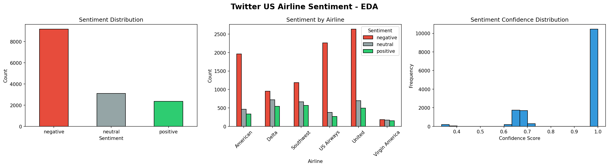
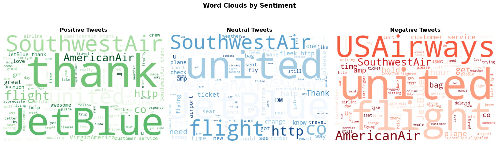
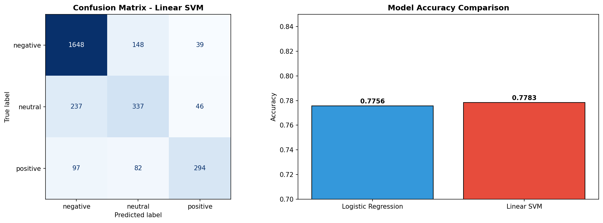

# 🧠 NLP Sentiment Analysis Platform

An end-to-end machine learning platform that analyzes sentiment in airline tweets — classifying them as **positive**, **neutral**, or **negative** in real-time.

---

## 📊 Project Overview

This platform processes raw tweet text through a full NLP pipeline and predicts customer sentiment — giving airlines actionable insight into passenger experience.

### Key Results
- 🎯 **Accuracy: 77.8%** on 3-class sentiment classification
- 📦 **Dataset: 14,640** labeled airline tweets
- ⚡ **Real-time prediction** via REST API
- 🔮 **Top sentiment drivers** identified through EDA and word clouds

---

## 🛠️ Tech Stack

| Layer | Technology |
|---|---|
| ML Model | Python, Scikit-learn, Linear SVM |
| NLP | NLTK, TF-IDF Vectorization |
| Analysis | Pandas, NumPy, Matplotlib, Seaborn, WordCloud |
| Backend | FastAPI, Uvicorn, Docker |
| Frontend | React, TypeScript, Recharts |
| Infrastructure | Docker, Docker Compose |

---

## 📁 Project Structure
nlp-sentiment-platform/
├── notebook/
│   └── sentiment_analysis.ipynb   # EDA, preprocessing, model training
├── model/
│   └── artifacts/                 # Saved plots (model files generated locally)
├── api/
│   ├── main.py                    # FastAPI app
│   ├── predict.py                 # Prediction logic
│   ├── schema.py                  # Request/response schemas
│   ├── requirements.txt
│   └── Dockerfile
├── frontend/
│   ├── src/
│   │   ├── App.tsx
│   │   └── components/
│   │       ├── Dashboard.tsx
│   │       └── AnalyzeForm.tsx
│   └── Dockerfile
├── docker-compose.yml
└── README.md

---

## ⚡ Quick Start

### Prerequisites
- Docker Desktop
- Node.js (for local frontend dev)
- Python 3.13 (for notebook)

### 1. Clone the repo
```bash
git clone https://github.com/A7MAD-04/nlp-sentiment-platform.git
cd nlp-sentiment-platform
```

### 2. Add the dataset
Download from Kaggle — [Twitter US Airline Sentiment](https://www.kaggle.com/datasets/crowdflower/twitter-airline-sentiment) and place `Tweets.csv` in the `data/` folder.

### 3. Run the notebook
Open `notebook/sentiment_analysis.ipynb` in VS Code and run all cells. This generates the model artifacts in `model/artifacts/`.

### 4. Start with Docker
```bash
docker compose up --build
```

- API: http://localhost:8000/docs
- Frontend: http://localhost:5173

---

## 📈 Key Findings

- **Negative sentiment dominates** — 62.7% of all tweets are negative
- **United & US Airways** have the highest complaint volume
- **Top negative keywords:** delayed, cancelled, customer service, luggage
- **Top positive keywords:** thank, great, love, awesome, JetBlue

---

## 📉 Model Performance

| Model | Accuracy |
|---|---|
| Linear SVM ✅ | 77.8% |
| Logistic Regression | 77.6% |

---

## 🖼️ Screenshots

### Dashboard


### Word Clouds


### Model Comparison
